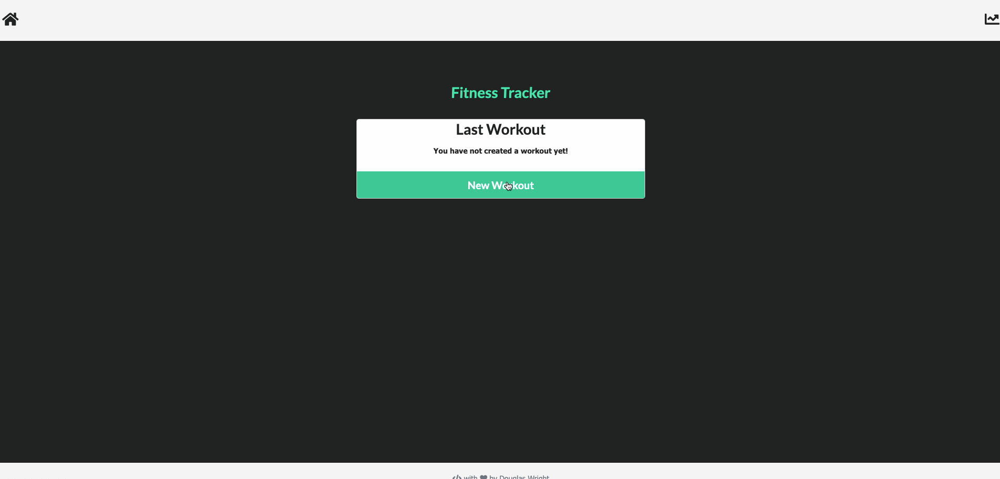
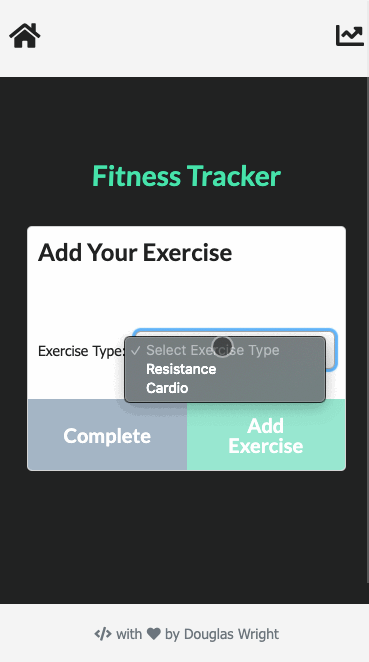

# Workout Tracker
A web app to view, create and track daily workouts. A user is able to log multiple exercises in a workout on a given day and track the name, type, weight, sets, reps, distance and duration of exercise. View multiple the combined weight of multiple exercises on the `stats` page. Powered with a Node backend running an Express server & pulling data from a NoSQL DB using the Mongoose ORM.

<p align="center">
   
   
</p>

## Getting Started Remotely

Play on the hosted [site](https://work-out-track-er.herokuapp.com/).
Or checkout the code in the [repo](https://github.com/Spazcool/workout-tracker).

## Getting Started Locally
### Prerequisites
* Node
* Mongo

### Instructions
1. Clone
```bash
git clone https://github.com/Spazcool/workout-tracker.git
```
2. Install dependencies
```bash
npm install
```
3. Run
```bash
node server
```

## Built With

* JS
  * Node
  * Express
  * Mongoose
* DB
  * Mongo
* HTML
* CSS
  * Semantic UI
  * Bootstrap

## Authors

* **Douglas Wright** - [Spazcool](https://github.com/Spazcool)

## License

This project is licensed under the MIT License - see the [LICENSE.md](LICENSE.md) file for details
